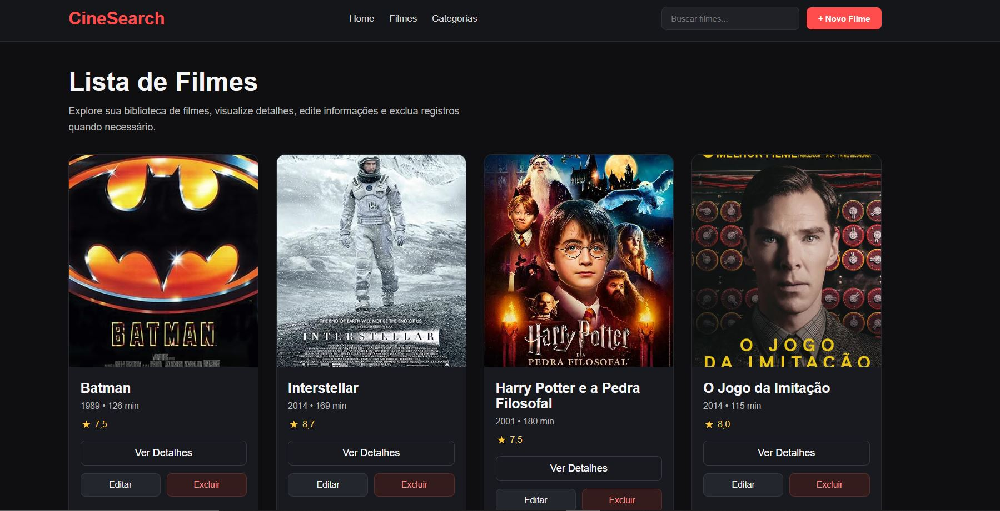
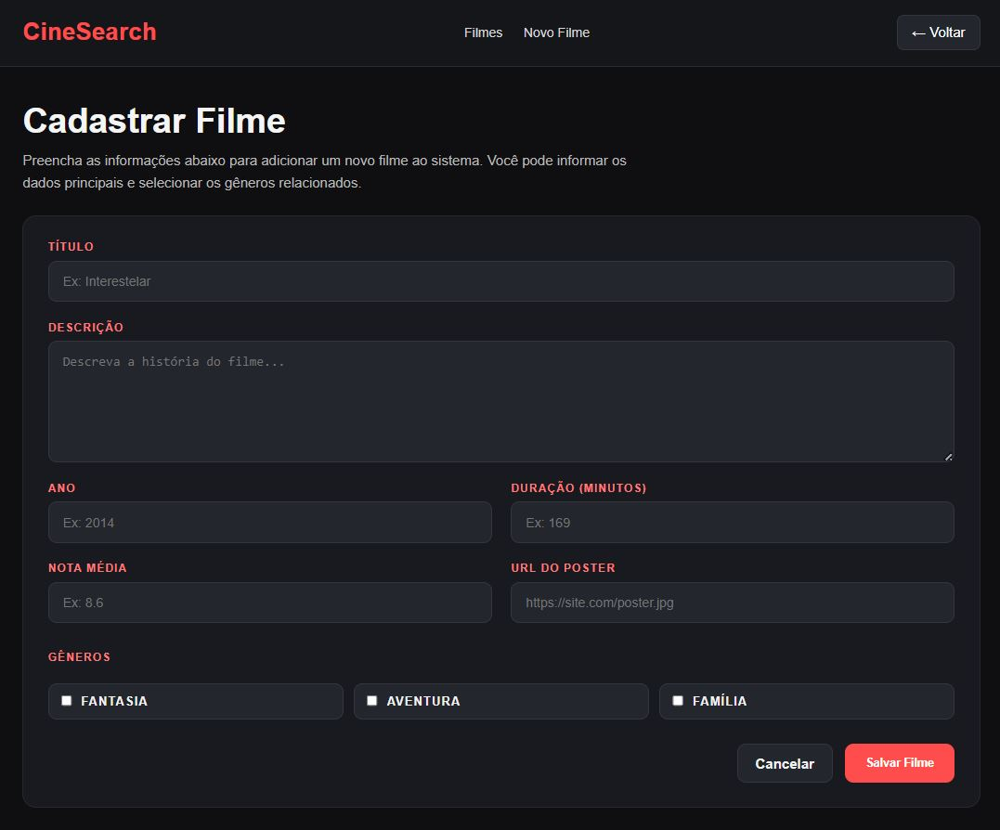
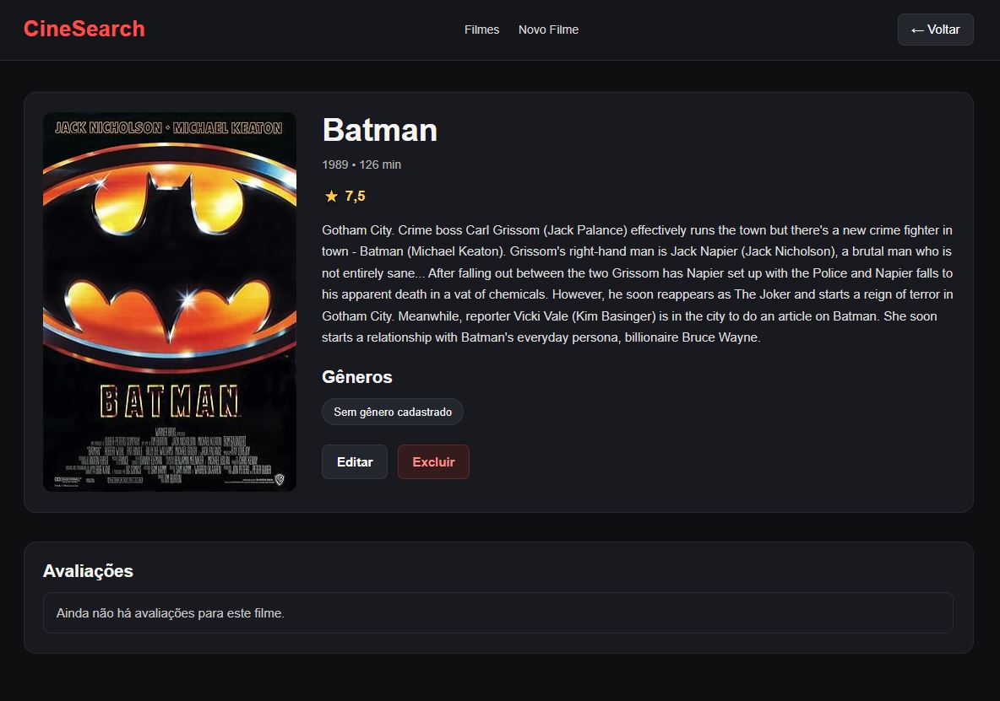
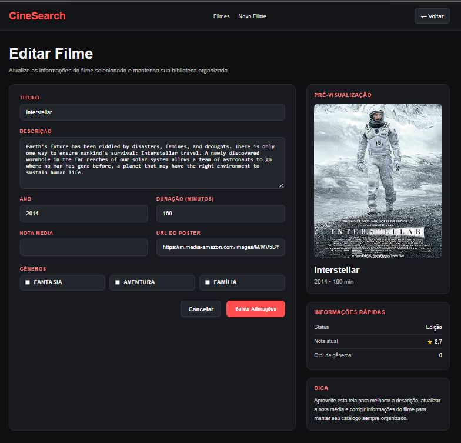
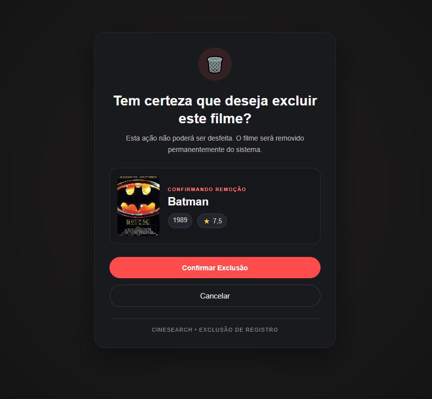

# 🎬 CineSearch - Sistema de Gerenciamento de Filmes

CineSearch é uma aplicação web desenvolvida com Django e Django REST Framework para gerenciamento de filmes.  
O sistema permite cadastrar, editar, visualizar e excluir filmes, além de integrar com uma API externa para importação automática de dados.

---

## 🚀 Funcionalidades

## 🎯 Escopo do Projeto

O objetivo deste projeto é desenvolver uma API REST completa para gerenciamento de filmes, utilizando boas práticas de desenvolvimento backend com Django e Django REST Framework.

O sistema permite:

- Gerenciar filmes (CRUD completo)
- Associar filmes a múltiplos gêneros
- Registrar avaliações com nota e comentário
- Integrar com API externa para importação de dados
- Disponibilizar endpoints REST para consumo
- Oferecer uma interface web simples para interação com o sistema

O projeto foi estruturado com foco em organização, escalabilidade e facilidade de manutenção.

### 🎥 CRUD de Filmes
- Criar filmes
- Listar filmes
- Visualizar detalhes
- Editar informações
- Excluir filmes

### 🎭 Gêneros
- Associação de filmes com múltiplos gêneros

### ⭐ Avaliações
- Sistema de avaliação com nota e comentário

### 🌐 Integração com API Externa (OMDb)
- Importação de filmes via API
- Preenchimento automático de:
  - título
  - descrição
  - ano
  - duração
  - nota
  - poster

### 🔐 Autenticação
- Autenticação via Token (Django REST Framework)

### 🐳 Docker
- Ambiente isolado com Docker
- Execução simplificada com docker-compose

### 🗄️ Banco de Dados
- PostgreSQL configurado e integrado via Docker

### 🎨 Interface Web
- Interface em HTML e CSS puro
- Design moderno e responsivo
- Telas implementadas:
  - Listagem de filmes
  - Detalhes
  - Cadastro
  - Edição
  - Exclusão

---

## 🛠️ Tecnologias Utilizadas

- Python  
- Django  
- Django REST Framework  
- PostgreSQL  
- Docker / Docker Compose  
- HTML5  
- CSS3  

---

## 🐳 Serviços Docker

O projeto utiliza dois containers principais:

- **web** → aplicação Django  
- **db** → banco de dados PostgreSQL  

Ambos são orquestrados pelo `docker-compose`.

---

## 🗄️ Banco de Dados (PostgreSQL)

A aplicação utiliza **PostgreSQL** como banco de dados principal.

### Configuração:

- Host: `db`
- Porta: `5432`
- Banco: `postgres`
- Usuário: `postgres`
- Senha: `postgres`

A conexão é feita automaticamente ao subir os containers.

---

## 📦 Como Executar o Projeto

### 🔧 Pré-requisitos

- Docker instalado  
- Docker Compose instalado  

---

### ▶️ Passos para execução

```bash
# Clonar o repositório
git clone https://github.com/seu-usuario/seu-repo.git

# Entrar na pasta do projeto
cd seu-repo

# Subir o projeto
docker-compose up --build
🔑 Variáveis de Ambiente

Crie um arquivo .env na raiz do projeto:

OMDB_API_KEY=sua_chave_aqui

👉 Para obter a chave gratuitamente:
https://www.omdbapi.com/apikey.aspx
```

## 🌐 Acessos
📌 Interface Web

http://localhost:8000/listar-filmes/

📌 Admin Django

http://localhost:8000/admin/

📌 API REST

http://localhost:8000/filmes/

### 🔍 Exemplos de Uso
📌 Importar filme pela API
- GET /importar-filme/?titulo=Batman

### 📂 Estrutura do Projeto
```bash
filmes/
 ├── models.py
 ├── views.py
 ├── serializers.py
 ├── urls.py
 └── templates/
      └── filmes/
           ├── listar_filmes.html
           ├── detalhe_filme.html
           ├── criar_filme.html
           ├── editar_filme.html
           └── excluir_filme.html
```

## 📡 Endpoints da API

### 🎥 Filmes
- `GET /filmes/` → Lista todos os filmes
- `POST /filmes/` → Cria um novo filme
- `GET /filmes/{id}/` → Retorna detalhes de um filme
- `PUT /filmes/{id}/` → Atualiza um filme completo
- `PATCH /filmes/{id}/` → Atualização parcial
- `DELETE /filmes/{id}/` → Remove um filme

---

### 🎭 Gêneros
- `GET /generos/`
- `POST /generos/`
- `GET /generos/{id}/`
- `PUT /generos/{id}/`
- `PATCH /generos/{id}/`
- `DELETE /generos/{id}/`

---

### ⭐ Avaliações
- `GET /avaliacoes/`
- `POST /avaliacoes/`
- `GET /avaliacoes/{id}/`
- `PUT /avaliacoes/{id}/`
- `PATCH /avaliacoes/{id}/`
- `DELETE /avaliacoes/{id}/`

---

### 🔐 Autenticação
- `POST /api-token-auth/` → Geração de token

---

### 🌐 Integração Externa
- `GET /importar-filme/?titulo=NomeDoFilme` → Importa filme da OMDb

## 🖥️ Rotas da Interface Web

- `GET /listar-filmes/` → Lista de filmes
- `GET /criar-filme/` → Cadastro de filme
- `GET /filme/{id}/` → Detalhes do filme
- `GET /editar-filme/{id}/` → Edição de filme
- `GET /excluir-filme/{id}/` → Confirmação de exclusão

## 🎯 Diferenciais do Projeto
- Integração com API externa (OMDb)
- Uso de PostgreSQL com Docker
- Ambiente isolado e reproduzível
- Interface completa com HTML/CSS
- Estrutura organizada e escalável
- CRUD completo com boas práticas

## 📌 Melhorias Futuras
- Auto-preenchimento de formulário via API
- Sistema completo de usuários (login/registro)
- Upload de imagens local
- Paginação na listagem
- Filtros avançados

## 📸 Demonstração da Interface

### 🎥 Listagem de Filmes


---

### ➕ Cadastro de Filme


---

### 🔍 Detalhes do Filme


---

### ✏️ Edição de Filme


---

### 🗑️ Exclusão de Filme


---

## 👨‍💻 Autor
Desenvolvido por Arllan L.

## 📄 Licença
Projeto desenvolvido para fins educacionais e processo seletivo.
